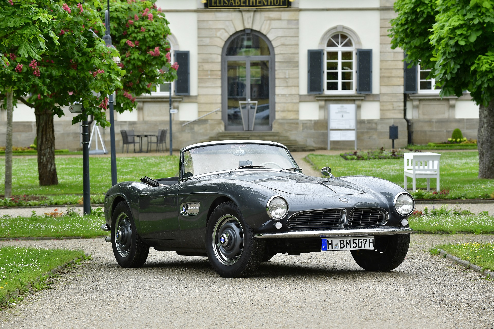
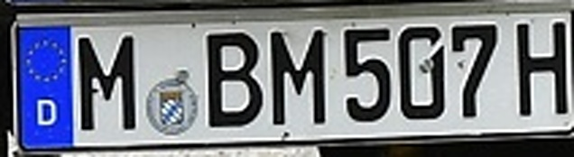
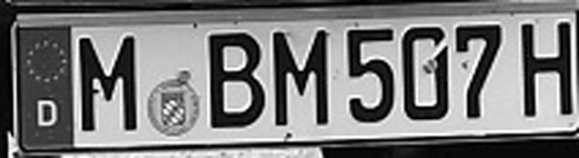
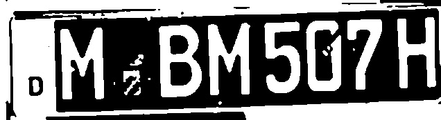
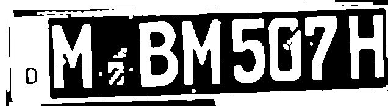
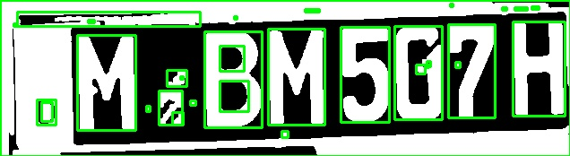
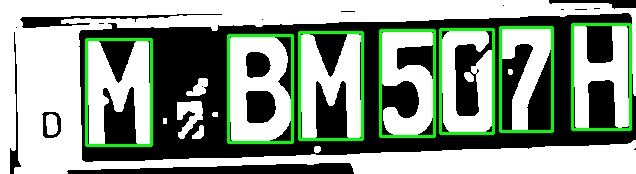
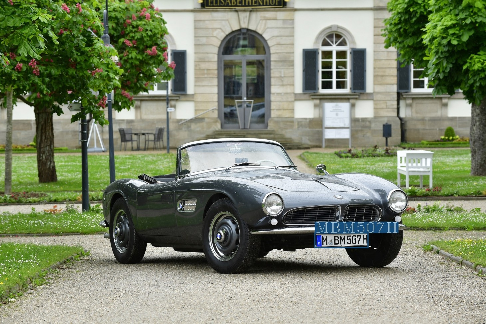

# __Number Plate Recognition__

## Table of Contents
- [About](#about)
- [Built With](#built-with)
- [Image Processing Workflow](#image-processing-workflow)
- [References](#references)
    
## About
This project is built to extract alphanumerics from vehicle number plates. It works for images as well as (pre-recorded) videos.

I used (SOTA) YOLOv4 as the base model and custom-trained it to detect number plates. The model was trained on images acquired from Google's Open Image Dataset.
Once the coordinates of the number plates are obtained (using the YOLOv4 model), they are processed using OpenCV and then sent to Tesseract OCR, which extracts the alphanumerics out of them.

To make the project more user-friendly, I hosted a web application on Streamlit Share. Streamlit and OpenCV are used to build the web application.

## Built With
- YOLOv4 (Detections)
- Tesseract OCR (Alphanumeric Extraction)
- OpenCV (Image Processing)
- Streamlit (Web App)

## Image Processing Workflow
In this section, I'll walk you through the steps undertaken to extract data from the number plates.

This is the original image we got.



First, we get the bounding box coordinates of the number plate (obtained using YOLOv4). Then we take this bounded region of the image and scale it up by a factor of 3
```sh
image = cv2.resize( image, None, fx = 3, fy = 3, interpolation = cv2.INTER_CUBIC)
```



Convert the image into gray-scale
```sh
gray = cv2.cvtColor(image, cv2.COLOR_RGB2GRAY)
```



Blur the image with Gaussian and Median blurring
```sh
blur = cv2.GaussianBlur(gray, (5,5), 0)
blur = cv2.medianBlur(blur, 3)
```


Otsu's thresholding
```sh
ret, thresh = cv2.threshold(blur, 0, 255, cv2.THRESH_OTSU | cv2.THRESH_BINARY_INV)
```




Dilate the image
```sh
rect_kern = cv2.getStructuringElement(cv2.MORPH_RECT, (3,3))  # create the structuring element
dilation = cv2.dilate(thresh, rect_kern, iterations = 1)
```




Get contours
```sh
try:
	contours, hierarchy = cv2.findContours(dilation, cv2.RETR_TREE, cv2.CHAIN_APPROX_SIMPLE)
except:
	ret_img, contours, hierarchy = cv2.findContours(dilation, cv2.RETR_TREE, cv2.CHAIN_APPROX_SIMPLE)
```




Sort the contours in their order of appearance from left to right so that the alphabets and numbers can be extracted sequentially by Tesseract OCR
```sh
sorted_contours = sorted(contours, key=lambda ctr: cv2.boundingRect(ctr)[0])
```



With this, we are done processing the image. Now we pass each character bounded by its contour to Tesseract to get the outputs and print them on the original image.


## References
- https://github.com/theAIGuysCode/yolov4-custom-functions.git
- https://learnopencv.com/deep-learning-based-object-detection-using-yolov3-with-opencv-python-c/